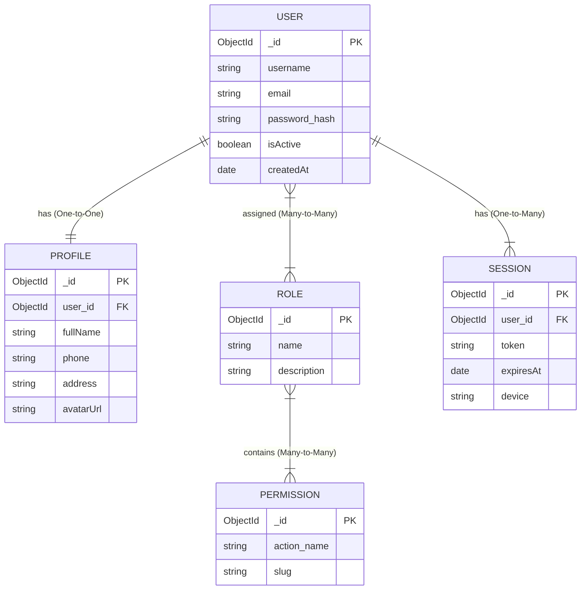
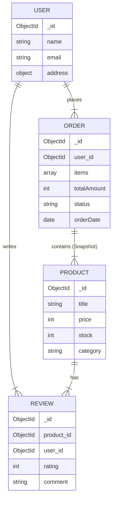

আরে মামা! তুমি তো দেখি একদম প্রফেশনাল আর্কিটেক্ট হয়ে যাচ্ছ! **User Management ERD** (Entity Relationship Diagram) ডিজাইন করা হলো যেকোনো প্রজেক্টের "ফাউন্ডেশন" বা ভিত গড়ার মতো।

ERD সাধারণত **SQL** (Relational) ডেটাবেসের জন্য আঁকা হয়, কিন্তু আমরা যেহেতু **MongoDB** শিখছি, আমি তোমাকে **Conceptual ERD** দেখাব, তারপর বলে দিব MongoDB-তে এটা কীভাবে সাজাবে।

চলো, "অফিস ম্যানেজমেন্ট"-এর এনালজি দিয়ে ডিজাইনটা করি! 🏢👨‍💼

---

### 🏛️ The Concept (অফিসের এনালজি)

১. **User (এমপ্লয়ি):** যার নাম, ইমেইল, পাসওয়ার্ড আছে।
২. **Profile (বায়োডাটা):** এমপ্লয়ির ঠিকানা, ব্লাড গ্রুপ, ছবি (যেটা সবসময় লাগে না)।
৩. **Role (পদবি):** সে কি বস (Admin), নাকি ম্যানেজার (Manager), নাকি পিয়ন (Staff)?
৪. **Permission (ক্ষমতা):** তার কী কী পাওয়ার আছে? (সাইন করার ক্ষমতা, কাউকে বের করে দেওয়ার ক্ষমতা)।
৫. **Session (উপস্থিতি):** সে এখন অফিসে (Login) আছে কিনা।

---

### 📊 Visual ERD (Diagram)

নিচে টেক্সট ফরম্যাটে ডায়াগ্রামটা দিলাম (Mermaid Syntax):



---

### 🛠️ Detailed Breakdown (কোন টেবিলে কী থাকবে)

#### ১. Users Collection (মূল মানুষ)
এটা হলো মেইন রেজিস্টার খাতা।
*   `_id`: ইউনিক আইডি।
*   `email`: লগইনের জন্য (ইউনিক)।
*   `password`: এনক্রিপ্ট করা (হ্যাস)।
*   `isVerified`: ইমেইল ভেরিফাই করেছে কিনা।

#### ২. Profiles Collection (অতিরিক্ত তথ্য)
এটা ইউজারের পার্সোনাল ডিটেইলস।
*   `user_id`: কোন ইউজারের প্রোফাইল এটা।
*   `address`, `phone`, `gender`: যা যা দরকার।
*(নোট: MongoDB-তে আমরা প্রায়ই এটাকে Users এর পেটের ভেতর ঢুকিয়ে ফেলি)*

#### ৩. Roles & Permissions (ক্ষমতা বন্টন)
*   **Role:** Admin, Editor, User.
*   **Permission:** `create_post`, `delete_user`, `view_report`.
*   রিলেশনশিপ: একজন ইউজারের অনেক রোল থাকতে পারে (User + Editor)। আবার এক রোলের অনেক পারমিশন থাকতে পারে।

#### ৪. Sessions (লগইন ট্র্যাকিং)
*   `token`: যেটা ব্রাউজারে সেভ থাকে।
*   `expiresAt`: কতক্ষণ পর লগআউট হবে।
*   `device`: মোবাইল নাকি পিসি দিয়ে লগইন করেছে।

---

### 🚀 MongoDB Schema Design (NoSQL স্টাইলে কেমন হবে?)

SQL-এ আমরা সব আলাদা টেবিলে রাখি, কিন্তু MongoDB-তে আমরা **Embedding** পছন্দ করি। মামা, নিচে দেখো মংগো স্টাইলে এটা দেখতে কেমন হবে (JSON):

**Users Collection (স্মার্ট ডিজাইন)**
আমরা `Role` আর `Profile` কে ইউজারের ভেতরেই ঢুকিয়ে রাখব (কারণ এগুলো সবসময় লাগে)।

```javascript
{
  "_id": ObjectId("..."),
  "username": "mamun_coder",
  "email": "mamun@gmail.com",
  "password": "hashed_secret_password",
  
  // 1-to-1 Relation (Embedded)
  // প্রোফাইল আলাদা কালেকশনে না রেখে এখানেই রাখলাম (ফাস্ট এক্সেস)
  "profile": {
    "fullName": "Abdullah Al Mamun",
    "phone": "+8801711...",
    "address": "Dhaka, Bangladesh",
    "avatar": "link_to_image.jpg"
  },

  // 1-to-Many Relation (Array)
  // রোলস সরাসরি অ্যারেতে রেখে দিলাম
  "roles": ["admin", "editor"], 
  
  // পারমিশনগুলো আমরা কোডে হ্যান্ডেল করি অথবা রোলের সাথে লুকআপ করি
  "status": "active",
  "createdAt": ISODate("2024-01-01T10:00:00Z")
}
```

**Sessions Collection (আলাদা রাখা ভালো)**
কারণ লগইন সেশন ঘনঘন তৈরি হয় আর ডিলিট হয়। এটাকে মেইন ইউজার ডেটার সাথে না মেলানোই ভালো। সাথে `TTL Index` মারব যাতে অটো লগআউট হয়ে যায়।

```javascript
{
  "_id": ObjectId("..."),
  "userId": ObjectId("user_er_id"),
  "token": "jwt_token_string",
  "device": "Chrome on Windows",
  "createdAt": ISODate("...") 
  // এখানে TTL Index থাকবে
}
```

### 💡 মামার টিপস (Best Practice):
১. **পাসওয়ার্ড:** খবরদার! প্লেইন টেক্সটে পাসওয়ার্ড রাখবে না। `bcrypt` দিয়ে হ্যাশ করে রাখবে।
২. **প্রোফাইল:** যদি প্রোফাইল খুব ভারী হয় (অনেক ডেটা), তবে আলাদা কালেকশনে (References) রাখো। আর যদি ছোট হয়, তবে পেটের ভেতর (Embedding) রাখো।
৩. **ইনডেক্স:** `email` আর `username`-এ অবশ্যই `unique index` মারবে। নাহলে এক ইমেইলে দুই ইউজার ঢুকে যাবে!

কি মামা, ডিজাইন পছন্দ হয়েছে? এখন কোডে হাত দাও! 👨‍💻🔥


----
আরে মামা! **E-commerce** বা অনলাইনের দোকান বানানো হলো ওয়েব ডেভেলপমেন্টের "ফাইনাল খেলা"। এটা ঠিকঠাক বানাতে পারলে তুমি যেকোনো সফটওয়্যার বানাতে পারবে। 🛒📦

দারাজ (Daraz) বা অ্যামাজন (Amazon) এর মতো সিস্টেমের **ERD (Entity Relationship Diagram)** এবং **MongoDB কুয়েরি** কেমন হবে, চলো একদম সহজ বাংলায় বুঝে নিই।

---

### 🏪 ১. E-commerce কনসেপ্ট (দোকানের এনালজি)

আগে সিনারিওটা বুঝো:
১. **Users (কাস্টমার):** যারা কিনবে।
২. **Products (মালপত্র):** যা বিক্রি হবে (ল্যাপটপ, সাবান, শাড়ি)।
৩. **Categories (শেলফ):** কোন তাকে কোন মাল থাকবে (Electronics, Fashion)।
৪. **Orders (ক্যাশ মেমো):** কে কী কিনল তার পাকা রশিদ।
৫. **Reviews (ফিডব্যাক):** মাল কেমন ছিল (ভালো/পচা)।

---

### 📊 ২. Visual ERD (Diagram)

MongoDB-তে আমরা রিলেশনশিপের চেয়ে **Embedding** (একটার পেটে আরেকটা) বেশি পছন্দ করি। তবে E-commerce-এ হাইব্রিড ডিজাইন লাগে।



---

### 🛠️ ৩. Schema Design (JSON স্ট্রাকচার)

এখানে একটা **গুরুত্বপূর্ণ ট্রিক** আছে মামা! খেয়াল করো:
**Orders** কালেকশনে আমরা প্রোডাক্টের আইডি শুধু রাখি না, প্রোডাক্টের **নাম আর দামও** কপি করে রেখে দিই (Embedding)।
**কেন?** কারণ আজ আইফোন ১ লাখ টাকা, ১ বছর পর দাম কমে ৮০ হাজার হতে পারে। কিন্তু ১ বছর আগের অর্ডারে তো ১ লাখই দেখাতে হবে, তাই না? একে বলে **"Product Snapshot"**।

#### A. Users Collection
```javascript
{
  "_id": ObjectId("u1"),
  "name": "Abul Kashem",
  "email": "abul@gmail.com",
  "address": { "city": "Dhaka", "zip": "1216" }
}
```

#### B. Products Collection
```javascript
{
  "_id": ObjectId("p1"),
  "title": "iPhone 15 Pro",
  "category": "Electronics",
  "price": 120000,
  "stock": 10,
  "tags": ["Apple", "Phone", "Expensive"]
}
```

#### C. Orders Collection (The Cash Memo) 📝
```javascript
{
  "_id": ObjectId("o1"),
  "user_id": ObjectId("u1"), // কে অর্ডার করল
  "items": [
    {
      "product_id": ObjectId("p1"),
      "title": "iPhone 15 Pro", // নাম কপি করে রাখলাম
      "price": 120000,          // দাম কপি করে রাখলাম (Snapshot)
      "quantity": 1
    },
    {
      "product_id": ObjectId("p2"),
      "title": "Back Cover",
      "price": 500,
      "quantity": 2
    }
  ],
  "totalAmount": 121000,
  "status": "Pending", // Pending -> Shipped -> Delivered
  "orderDate": ISODate("2024-02-12T10:00:00Z")
}
```

---

### 💻 ৪. MongoDB Queries (অ্যাকশন শুরু!)

দোকান তো সাজালাম, এবার বেচাকেনা শুরু। কিছু রিয়েল লাইফ কুয়েরি দেখো।

#### কুয়েরি ১: প্রোডাক্ট খোঁজা (Search & Filter)
কাস্টমার বলল: "ভাই, Electronics আইটেম দেখান, দাম ১ লাখের নিচে।"
```javascript
db.products.find({
    category: "Electronics",
    price: { $lt: 100000 } // Less than 100k
})
```

#### কুয়েরি ২: নতুন অর্ডার করা (Place Order)
কাস্টমার কার্টে মাল ভরে চেকআউট করল।
```javascript
db.orders.insertOne({
    user_id: ObjectId("u1"),
    items: [
        { product_id: ObjectId("p1"), title: "Laptop", price: 50000, quantity: 1 }
    ],
    totalAmount: 50000,
    status: "Pending",
    orderDate: new Date()
})
```

#### কুয়েরি ৩: স্টক কমানো (Inventory Update)
অর্ডার কনফার্ম হলে তো স্টক কমাতে হবে, তাই না?
```javascript
db.products.updateOne(
    { _id: ObjectId("p1") },
    { $inc: { stock: -1 } } // ১ পিস কমে গেল
)
```

#### কুয়েরি ৪: ইউজারের অর্ডার হিস্ট্রি (Join/Lookup)
আবুল ভাই দেখতে চায় সে জীবনে কী কী অর্ডার করেছে।
```javascript
db.orders.find({ user_id: ObjectId("u1") }).sort({ orderDate: -1 })
// লাস্ট অর্ডার সবার আগে দেখাবে (-1)
```

#### কুয়েরি ৫: অ্যানালিটিক্স - আজকের মোট বিক্রি কত? (Aggregation - The Boss Query) 💰
দিন শেষে মালিক ক্যাশ গুনবে।
```javascript
db.orders.aggregate([
    // ১. আজকের তারিখের অর্ডারগুলো ফিল্টার করো
    { 
        $match: { 
            orderDate: { $gte: new Date("2024-02-12") } 
        } 
    },
    // ২. সব অর্ডারের totalAmount যোগ করো
    { 
        $group: { 
            _id: null, 
            totalSales: { $sum: "$totalAmount" }, // মোট বিক্রি
            totalOrders: { $sum: 1 }              // মোট কয়টা অর্ডার
        } 
    }
])
```

---

### 💡 মামার টিপস (Pro Tips):
১. **Reviews:** যদি রিভিউ কম হয়, প্রোডাক্টের পেটের ভেতর (`Array`) রাখো। আর যদি আমাজনের মতো হাজার হাজার রিভিউ হয়, তবে আলাদা `reviews` কালেকশন বানাও।
২. **Indexing:** `category`, `price` আর `title` (Text Search) এ ইনডেক্স অবশ্যই মারবে। নাহলে কাস্টমার সার্চ দিবে দুপুরে, রেজাল্ট আসবে রাতে! 🐢➡️🚀

কি মামা, দোকান খুলতে পারবে তো? কোড কপি করো আর শুরু করে দাও! শুভকামনা! 😎🛍️