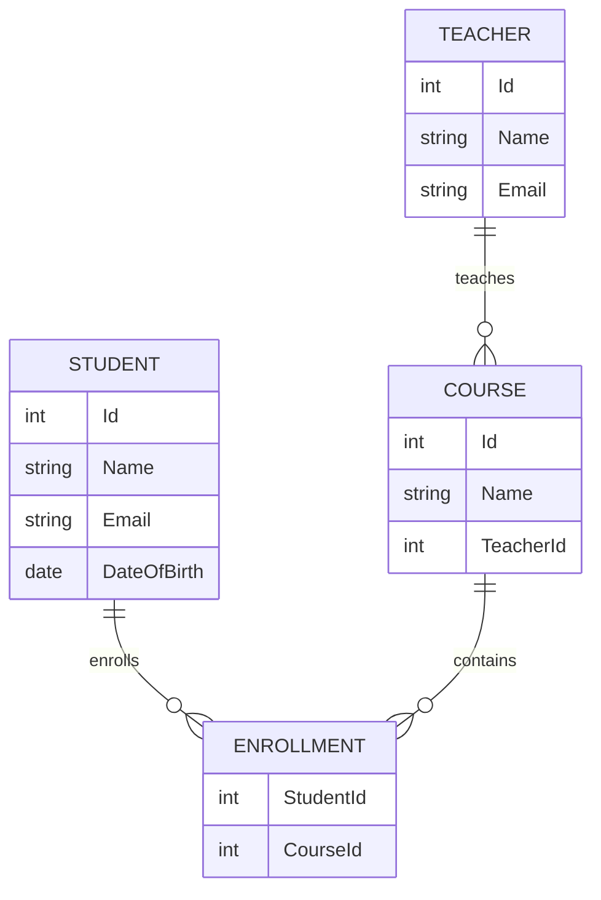

As an AI developer, I’ll guide you through building a **School Management System** using an **MCP Server** with .NET, incorporating a database, Web API, Clean Architecture, documentation, and an ER diagram. The MCP server will expose tools for the AI to interact with the system (e.g., fetching student data, adding records). Below, I’ll outline the steps, provide explanations, and include a step-by-step example with artifacts for key components.

---

### Overview of the School Management System with MCP Server

The School Management System will:
- Manage **students**, **teachers**, and **courses**.
- Use an **MCP Server** to expose tools (e.g., get student details, enroll students in courses).
- Include a **Web API** for external access.
- Follow **Clean Architecture** for scalability and maintainability.
- Use a **database** (SQLite for simplicity).
- Generate **documentation** and an **ER diagram**.

#### Components
1. **Database**: SQLite database to store students, teachers, and courses.
2. **MCP Server**: Exposes tools to query/add data, integrated with the database.
3. **Web API**: RESTful API for external clients (e.g., a frontend app).
4. **Clean Architecture**: Organizes the codebase into Domain, Application, Infrastructure, and Presentation layers.
5. **Documentation**: API documentation using Swagger and project overview.
6. **ER Diagram**: Visual representation of the database schema.

#### Tools and Technologies
- **.NET 9**: For building the MCP server and Web API.
- **MCP C# SDK**: For creating the MCP server.
- **Entity Framework Core**: For database operations.
- **SQLite**: Lightweight database.
- **Clean Architecture**: For structuring the project.
- **Swagger**: For API documentation.
- **Mermaid**: For generating the ER diagram.

---

### Step-by-Step Implementation

#### Step 1: Set Up the Project Structure (Clean Architecture)
Clean Architecture organizes the code into layers:
- **Domain**: Core entities and business rules (e.g., Student, Teacher).
- **Application**: Business logic and use cases (e.g., GetStudentById).
- **Infrastructure**: External services (e.g., database, MCP server).
- **Presentation**: API and MCP server endpoints.

**Steps**:
1. Create a solution:
   ```bash
   dotnet new sln -n SchoolManagement
   ```

2. Create projects for each layer:
   ```bash
   dotnet new classlib -n SchoolManagement.Domain
   dotnet new classlib -n SchoolManagement.Application
   dotnet new classlib -n SchoolManagement.Infrastructure
   dotnet new webapi -n SchoolManagement.Presentation
   ```

3. Add projects to the solution:
   ```bash
   dotnet sln add SchoolManagement.Domain
   dotnet sln add SchoolManagement.Application
   dotnet sln add SchoolManagement.Infrastructure
   dotnet sln add SchoolManagement.Presentation
   ```

4. Set up project references:
   ```bash
   dotnet add SchoolManagement.Application reference SchoolManagement.Domain
   dotnet add SchoolManagement.Infrastructure reference SchoolManagement.Application
   dotnet add SchoolManagement.Presentation reference SchoolManagement.Infrastructure
   ```

---

#### Step 2: Define the Database Schema and Entities
We’ll use SQLite with Entity Framework Core to manage the database. The schema includes:
- **Students**: ID, Name, Email, DateOfBirth.
- **Teachers**: ID, Name, Email.
- **Courses**: ID, Name, TeacherId.
- **Enrollments**: StudentId, CourseId (many-to-many relationship).

**Artifact**: Domain Entities (`SchoolManagement.Domain/Entities`)

```csharp
namespace SchoolManagement.Domain;

public class Student
{
    public int Id { get; set; }
    public string Name { get; set; } = string.Empty;
    public string Email { get; set; } = string.Empty;
    public DateTime DateOfBirth { get; set; }
    public List<Enrollment> Enrollments { get; set; } = new();
}

public class Teacher
{
    public int Id { get; set; }
    public string Name { get; set; } = string.Empty;
    public string Email { get; set; } = string.Empty;
    public List<Course> Courses { get; set; } = new();
}

public class Course
{
    public int Id { get; set; }
    public string Name { get; set; } = string.Empty;
    public int TeacherId { get; set; }
    public Teacher Teacher { get; set; } = null!;
    public List<Enrollment> Enrollments { get; set; } = new();
}

public class Enrollment
{
    public int StudentId { get; set; }
    public Student Student { get; set; } = null!;
    public int CourseId { get; set; }
    public Course Course { get; set; } = null!;
}
```

**Summary**: These entities define the core data models. The `Enrollment` class handles the many-to-many relationship between `Student` and `Course`.

---

#### Step 3: Set Up the Database with EF Core
Configure Entity Framework Core in the Infrastructure layer to use SQLite.

**Steps**:
1. Install EF Core packages in `SchoolManagement.Infrastructure`:
   ```bash
   cd SchoolManagement.Infrastructure
   dotnet add package Microsoft.EntityFrameworkCore.Sqlite
   dotnet add package Microsoft.EntityFrameworkCore.Design
   ```

2. Create a `DbContext` to manage database operations.

**Artifact**: DbContext (`SchoolManagement.Infrastructure/Data/SchoolDbContext.cs`)

```csharp
using Microsoft.EntityFrameworkCore;
using SchoolManagement.Domain;

namespace SchoolManagement.Infrastructure.Data;

public class SchoolDbContext : DbContext
{
    public DbSet<Student> Students { get; set; }
    public DbSet<Teacher> Teachers { get; set; }
    public DbSet<Course> Courses { get; set; }
    public DbSet<Enrollment> Enrollments { get; set; }

    public SchoolDbContext(DbContextOptions<SchoolDbContext> options) : base(options)
    {
    }

    protected override void OnModelCreating(ModelBuilder modelBuilder)
    {
        modelBuilder.Entity<Enrollment>()
            .HasKey(e => new { e.StudentId, e.CourseId });

        modelBuilder.Entity<Enrollment>()
            .HasOne(e => e.Student)
            .WithMany(s => s.Enrollments)
            .HasForeignKey(e => e.StudentId);

        modelBuilder.Entity<Enrollment>()
            .HasOne(e => e.Course)
            .WithMany(c => c.Enrollments)
            .HasForeignKey(e => e.CourseId);

        modelBuilder.Entity<Course>()
            .HasOne(c => c.Teacher)
            .WithMany(t => t.Courses)
            .HasForeignKey(c => c.TeacherId);
    }
}
```

3. Configure the database in `SchoolManagement.Presentation` (Startup/Configuration).

**Artifact**: Program.cs (`SchoolManagement.Presentation/Program.cs`)

```csharp
using Microsoft.EntityFrameworkCore;
using SchoolManagement.Infrastructure.Data;

var builder = WebApplication.CreateBuilder(args);

// Add services to the container.
builder.Services.AddControllers();
builder.Services.AddEndpointsApiExplorer();
builder.Services.AddSwaggerGen();

// Configure DbContext
builder.Services.AddDbContext<SchoolDbContext>(options =>
    options.UseSqlite("Data Source=school.db"));

var app = builder.Build();

// Configure the HTTP request pipeline.
if (app.Environment.IsDevelopment())
{
    app.UseSwagger();
    app.UseSwaggerUI();
}

app.UseHttpsRedirection();
app.UseAuthorization();
app.MapControllers();

app.Run();
```

4. Create and apply migrations:
   ```bash
   cd SchoolManagement.Presentation
   dotnet add package Microsoft.EntityFrameworkCore.Design
   dotnet ef migrations add InitialCreate -c SchoolDbContext -o Data/Migrations
   dotnet ef database update
   ```

**Summary**: The database is set up with SQLite, and migrations create the schema based on the entities.

---

#### Step 4: Create the MCP Server
The MCP server will expose tools to:
- Get a student by ID.
- Enroll a student in a course.

**Steps**:
1. Install MCP packages in `SchoolManagement.Infrastructure`:
   ```bash
   cd SchoolManagement.Infrastructure
   dotnet add package ModelContextProtocol --prerelease
   dotnet add package Microsoft.Extensions.Hosting
   ```

2. Create MCP tools to interact with the database.

**Artifact**: MCP Tools (`SchoolManagement.Infrastructure/McpTools/SchoolMcpTools.cs`)

```csharp
using System.ComponentModel;
using Microsoft.EntityFrameworkCore;
using ModelContextProtocol.Server;
using SchoolManagement.Domain;
using SchoolManagement.Infrastructure.Data;

namespace SchoolManagement.Infrastructure.McpTools;

[McpServerToolType]
public class SchoolMcpTools
{
    private readonly SchoolDbContext _dbContext;

    public SchoolMcpTools(SchoolDbContext dbContext)
    {
        _dbContext = dbContext;
    }

    [McpServerTool, Description("Gets a student by their ID.")]
    public async Task<string> GetStudentById(int id)
    {
        var student = await _dbContext.Students
            .Include(s => s.Enrollments)
            .ThenInclude(e => e.Course)
            .FirstOrDefaultAsync(s => s.Id == id);

        if (student == null)
            return "Student not found.";

        return $"Student: {student.Name}, Email: {student.Email}, Enrolled Courses: {string.Join(", ", student.Enrollments.Select(e => e.Course.Name))}";
    }

    [McpServerTool, Description("Enrolls a student in a course.")]
    public async Task<string> EnrollStudent(int studentId, int courseId)
    {
        var student = await _dbContext.Students.FindAsync(studentId);
        var course = await _dbContext.Courses.FindAsync(courseId);

        if (student == null || course == null)
            return "Student or course not found.";

        var enrollment = new Enrollment { StudentId = studentId, CourseId = courseId };
        _dbContext.Enrollments.Add(enrollment);
        await _dbContext.SaveChangesAsync();

        return $"Student {student.Name} enrolled in {course.Name}.";
    }
}
```

3. Configure the MCP server in `SchoolManagement.Presentation`.

**Artifact**: MCP Server Setup (`SchoolManagement.Presentation/Program.cs` - Updated)

```csharp
using Microsoft.EntityFrameworkCore;
using Microsoft.Extensions.Hosting;
using ModelContextProtocol.Server;
using SchoolManagement.Infrastructure.Data;
using SchoolManagement.Infrastructure.McpTools;

var builder = WebApplication.CreateBuilder(args);

// Add services to the container.
builder.Services.AddControllers();
builder.Services.AddEndpointsApiExplorer();
builder.Services.AddSwaggerGen();

// Configure DbContext
builder.Services.AddDbContext<SchoolDbContext>(options =>
    options.UseSqlite("Data Source=school.db"));

// Configure MCP Server
builder.Services
    .AddMcpServer()
    .WithStdioServerTransport()
    .WithTools();

builder.Services.AddHostedService<McpHostedService>();

var app = builder.Build();

// Configure the HTTP request pipeline.
if (app.Environment.IsDevelopment())
{
    app.UseSwagger();
    app.UseSwaggerUI();
}

app.UseHttpsRedirection();
app.UseAuthorization();
app.MapControllers();

app.Run();

public class McpHostedService : IHostedService
{
    private readonly IHostApplicationLifetime _lifetime;

    public McpHostedService(IHostApplicationLifetime lifetime)
    {
        _lifetime = lifetime;
    }

    public Task StartAsync(CancellationToken cancellationToken)
    {
        return Task.CompletedTask;
    }

    public Task StopAsync(CancellationToken cancellationToken)
    {
        return Task.CompletedTask;
    }
}
```

**Summary**: The MCP server is integrated with the application, exposing tools to query and modify the database. It uses STDIO transport for simplicity.

---

#### Step 5: Create the Web API
The Web API provides endpoints to:
- Get all students.
- Add a new student.

**Steps**:
1. Create application interfaces and services in `SchoolManagement.Application`.

**Artifact**: Application Interfaces (`SchoolManagement.Application/IStudentService.cs`)

```csharp
using SchoolManagement.Domain;

namespace SchoolManagement.Application;

public interface IStudentService
{
    Task<List<Student>> GetAllStudentsAsync();
    Task<Student> AddStudentAsync(Student student);
}
```

**Artifact**: Application Service (`SchoolManagement.Application/StudentService.cs`)

```csharp
using SchoolManagement.Domain;
using SchoolManagement.Infrastructure.Data;

namespace SchoolManagement.Application;

public class StudentService : IStudentService
{
    private readonly SchoolDbContext _dbContext;

    public StudentService(SchoolDbContext dbContext)
    {
        _dbContext = dbContext;
    }

    public async Task<List<Student>> GetAllStudentsAsync()
    {
        return await _dbContext.Students.ToListAsync();
    }

    public async Task<Student> AddStudentAsync(Student student)
    {
        _dbContext.Students.Add(student);
        await _dbContext.SaveChangesAsync();
        return student;
    }
}
```

2. Create the API controller in `SchoolManagement.Presentation`.

**Artifact**: API Controller (`SchoolManagement.Presentation/Controllers/StudentsController.cs`)

```csharp
using Microsoft.AspNetCore.Mvc;
using SchoolManagement.Application;
using SchoolManagement.Domain;

namespace SchoolManagement.Presentation.Controllers;

[ApiController]
[Route("api/[controller]")]
public class StudentsController : ControllerBase
{
    private readonly IStudentService _studentService;

    public StudentsController(IStudentService studentService)
    {
        _studentService = studentService;
    }

    [HttpGet]
    public async Task<IActionResult> GetAll()
    {
        var students = await _studentService.GetAllStudentsAsync();
        return Ok(students);
    }

    [HttpPost]
    public async Task<IActionResult> Add(Student student)
    {
        var addedStudent = await _studentService.AddStudentAsync(student);
        return CreatedAtAction(nameof(GetAll), new { id = addedStudent.Id }, addedStudent);
    }
}
```

3. Register services in `Program.cs` (already updated above).

**Summary**: The Web API provides RESTful endpoints to interact with the database, following Clean Architecture principles.

---

#### Step 6: Generate Documentation
Use Swagger for API documentation and create a project overview document.

**Steps**:
1. Swagger is already configured in `Program.cs`.
2. Create a project overview document.

**Artifact**: Project Documentation (`docs/ProjectOverview.md`)


# School Management System

## Overview
The School Management System is a .NET application that manages students, teachers, and courses. It integrates an MCP server for AI interactions, a Web API for external access, and follows Clean Architecture for maintainability.

## Features
- **Database**: SQLite database with entities for Students, Teachers, Courses, and Enrollments.
- **MCP Server**: Exposes tools to get student details and enroll students in courses.
- **Web API**: RESTful endpoints to manage students.
- **Clean Architecture**: Separates concerns into Domain, Application, Infrastructure, and Presentation layers.

## Setup
1. Clone the repository.
2. Install .NET 9 SDK.
3. Run `dotnet restore` to install dependencies.
4. Apply migrations: `dotnet ef database update`.
5. Run the application: `dotnet run --project SchoolManagement.Presentation`.

## API Endpoints
- **GET /api/students**: Retrieves all students.
- **POST /api/students**: Adds a new student.

## MCP Tools
- **GetStudentById**: Retrieves a student by ID.
- **EnrollStudent**: Enrolls a student in a course.

## Testing
- Use Swagger UI at `http://localhost:5000/swagger` for API testing.
- Use MCP Inspector (`npx @modelcontextprotocol/inspector dotnet run`) for MCP server testing.


**Summary**: The documentation provides a clear overview and instructions for using the system.

---

#### Step 7: Create an ER Diagram
Use Mermaid to create an ER diagram for the database schema.

**Artifact**: ER Diagram (`docs/ERDiagram.mmd`)



**Summary**: The ER diagram visually represents the relationships between entities. You can render it using a Mermaid-compatible tool (e.g., Mermaid Live Editor).

---

#### Step 8: Test the System
1. **Run the Application**:
   ```bash
   cd SchoolManagement.Presentation
   dotnet run
   ```

2. **Test the Web API**:
   - Open `http://localhost:5000/swagger` in your browser.
   - Test `GET /api/students` and `POST /api/students`.

3. **Test the MCP Server**:
   - Run MCP Inspector:
     ```bash
     npx @modelcontextprotocol/inspector dotnet run
     ```
   - Open `http://localhost:5173`, connect, and test the `GetStudentById` and `EnrollStudent` tools.

4. **Test with Claude Desktop** (Optional):
   - Configure Claude Desktop as described in the previous response.
   - Ask: “Get student with ID 1” or “Enroll student 1 in course 1”.

---

#### Step 9: Deploy (Optional)
To deploy the application:
1. **Web API**: Host on Azure App Service or AWS Elastic Beanstalk.
2. **MCP Server**: Use SSE transport for remote access (requires additional configuration).
3. **Database**: Migrate to a cloud database (e.g., Azure SQL) for production.

---

### Example Output
- **Web API**:
  - `GET /api/students`: Returns `[{ "id": 1, "name": "John Doe", "email": "john@example.com", "dateOfBirth": "2000-01-01" }]`.
  - `POST /api/students`: Adds a new student and returns it.

- **MCP Server**:
  - `GetStudentById(1)`: Returns “Student: John Doe, Email: john@example.com, Enrolled Courses: Math”.
  - `EnrollStudent(1, 1)`: Returns “Student John Doe enrolled in Math”.

- **ER Diagram**: Visualizes the relationships (Student ↔ Enrollment ↔ Course, Teacher ↔ Course).

---

### Additional Notes
- **Security**: Validate MCP inputs to prevent injection attacks. Use authentication for the Web API in production.
- **Scalability**: Extend the system by adding more entities (e.g., Attendance, Grades) or MCP tools.
- **Documentation**: Update the documentation as you add features.
- **MCP Evolution**: The MCP C# SDK is in preview, so check for updates on GitHub.

This implementation provides a fully functional School Management System with an MCP server, Web API, Clean Architecture, documentation, and an ER diagram. If you need further details or additional features (e.g., more MCP tools, authentication), let me know!